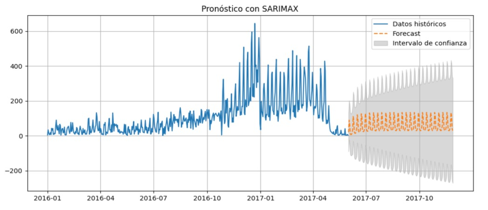

# BI Challenge - SQL Focused Analysis

This repository contains my SQL-based solution to a data analytics challenge involving restaurant reservations and visits in Japan. The goal was to extract insights about visitor behavior using cleaned CSV datasets and structured SQL queries.
**You can find the complete Script for the queries in the bi_challenge_sql file

---

## 🗃️ Data Preparation

### Step 1: Data Cleaning (in Python)

* Adjusted inconsistent date/time formats in the CSV files using pandas.
* Replaced `#values` and other invalid entries with `NULL` to ensure correct SQL loading and manipulation.

### Step 2: Import to MySQL

Created a schema `bi_challenge` and defined tables:

```sql
USE bi_challenge;

CREATE TABLE restaurants_visitors (
    id VARCHAR(20),
    visit_date DATE,
    visit_datetime DATETIME,
    reserve_datetime DATETIME,
    reserve_visitors INT
);

CREATE TABLE date_info (
    calendar_date DATE,
    day_of_week VARCHAR(20),
    holiday_flg TINYINT
);

CREATE TABLE store_info (
    store_id VARCHAR(255),
    genre_name VARCHAR(255),
    area_name VARCHAR(255),
    latitude DECIMAL(10, 7),
    longitude DECIMAL(10, 7)
);
```

Loaded data using:

```sql
LOAD DATA INFILE '.../restaurants_visitors_limpio.csv' ...;
LOAD DATA INFILE '.../store_info.csv' ...;
```

## ✅ Data Validation

Counted `NULL` values per column:

```sql
SELECT COUNT(*) - COUNT(column_name) AS nulls FROM table_name;
```

Created a cleaned version:

```sql
CREATE TABLE restaurants_visits_filled AS
SELECT
    id,
    DATE(visit_datetime) AS visit_date,
    visit_datetime,
    reserve_datetime,
    reserve_visitors
FROM restaurants_visitors;
```

---

## 🔍 SQL Analysis

### 1. Top 5 Restaurants with Highest Avg. Visitors on Holidays

Grouped data by day to avoid per-hour bias:

```sql
WITH TotalByDay AS (
    SELECT id, visit_date, SUM(reserve_visitors) AS total_visitors_day
    FROM restaurants_visits_filled rv
    LEFT JOIN date_info di ON rv.visit_date = di.calendar_date
    WHERE holiday_flg = 1
    GROUP BY id, visit_date
),
Ranking AS (
    SELECT id, ROUND(AVG(total_visitors_day), 0) AS avg_visitors,
           DENSE_RANK() OVER (ORDER BY AVG(total_visitors_day) DESC) AS restaurants_ranking
    FROM TotalByDay
    GROUP BY id
)
SELECT r.id, si.genre_name, r.avg_visitors, r.restaurants_ranking
FROM Ranking r
JOIN store_info si ON r.id = si.store_id
WHERE restaurants_ranking BETWEEN 1 AND 5
ORDER BY restaurants_ranking;
```

---

### 2. Best Day of the Week (All Restaurants)

```sql
WITH RestDay AS (
    SELECT visit_date, day_of_week, SUM(reserve_visitors) AS avg_visitors
    FROM restaurants_visits_filled rv
    LEFT JOIN date_info di ON rv.visit_date = di.calendar_date
    GROUP BY visit_date, day_of_week
)
SELECT day_of_week, ROUND(AVG(avg_visitors), 1) AS avg_visitors
FROM RestDay
GROUP BY day_of_week
ORDER BY avg_visitors DESC;
```

---

### 3. Weekly Growth in Visitor Count (WoW)

```sql
WITH RestDay AS (
    SELECT visit_date, YEAR(visit_date) AS year, WEEK(visit_date) AS week_num,
           SUM(reserve_visitors) AS total_visitors
    FROM restaurants_visits_filled rv
    LEFT JOIN date_info di ON rv.visit_date = di.calendar_date
    GROUP BY visit_date
    HAVING year = 2017
)
SELECT week_num, SUM(total_visitors) AS visitors,
       LAG(SUM(total_visitors), 1) OVER (ORDER BY week_num) AS prev_week,
       ROUND(((SUM(total_visitors) / LAG(SUM(total_visitors), 1) OVER (ORDER BY week_num)) - 1) * 100, 2) AS WoW_change
FROM RestDay
GROUP BY week_num
HAVING week_num >= 19;
```

---

### 4. Visual Trend - Visitors by Day

```sql
WITH TotalByDay AS (
    SELECT visit_date, SUM(reserve_visitors) AS total_visitors_day
    FROM restaurants_visits_filled
    GROUP BY visit_date
)
SELECT *
FROM TotalByDay
ORDER BY visit_date;
```

> ⚠️ **Key Insight:** Since the data was initially at the hour level, grouping by day and restaurant was crucial to derive accurate, actionable insights.


---

## 📌 Summary

* **Data Engineering:** Cleaned, validated, and loaded multi-source time-based data into a MySQL environment.
* **Data Analysis:** Developed advanced SQL queries using CTEs, window functions, date functions, and aggregations.
* **Business Relevance:** Provided insights on top-performing restaurants, ideal visiting days, and growth trends.


# 🔮 Time Series Forecasting – SARIMAX Model

After completing the SQL-based exploratory analysis, a time series forecasting model was developed using Python to predict future restaurant reservations based on historical patterns.

---
### 🧩 Original Series – Restaurant Visitors

- The time series shows **missing data intervals**, which limit the ability to extract continuous trends.
- To enable full analysis, **data imputation** was required to fill these gaps.


---

### 🔧 Visitor Imputation

- A **linear regression** was fitted to the complete series to estimate the general trend.
- For missing days, the number of visitors was **simulated using a normal distribution**:

  - **μ (mean):** Estimated trend value at time *t*  
  - **σ (std dev):** Historical standard deviation of the series

> This approach generates **stochastic imputations** that are coherent with the observed behavior and variability.


---

### 🔍 Time Series Decomposition – Additive Model

The additive decomposition assumes that the observed series can be expressed as:

**Yₜ = Tₜ + Sₜ + Rₜ**

Where:
- **Tₜ (Trend):** Long-term progression of the series
- **Sₜ (Seasonal):** Repeating patterns over a fixed period (weekly seasonality in this case)
- **Rₜ (Residual):** Irregular variations not explained by trend or seasonality


#### Components from the Plot:
- **Original series (`reserve_visitors`):** Total number of visitors over time
- **Trend:** Highlights long-term increases or decreases
- **Seasonality:** Captures weekly visitor patterns
- **Residuals:** Random noise or outliers (notable irregularities appeared in late 2016 and early 2017)

---

### 🔮 Forecasting with SARIMAX Model

- Several configurations were tested; the best-performing model was:
  
  **SARIMAX(1, 0, 1) × (1, 1, 1, 7)**

- This model effectively captures **cyclical and seasonal structures**, forecasting 180 days ahead.
- **Wide confidence intervals** indicate increasing uncertainty as the forecast horizon extends.
- Toward the end of the observed series, **irregular patterns and potential outliers** emerged, likely tied to unusual events or data entry issues.



---

### ✅ Model Evaluation – Backtesting

- A **30-day backtesting window** was used prior to the forecast period.
- The model's predictions were compared to actual values, revealing challenges in anticipating irregular spikes or anomalies.


#### Performance Metrics on Test Set:
- **MAE:** 110.62  
- **RMSE:** 134.09  
- **MAPE:** 1388.71%


> ⚠️ The unusually high MAPE highlights the presence of extreme deviations in actual values, possibly due to outliers or unexpected visitor behavior.


## 📈 5. Strategies to Double Restaurant Visitors in Six Months (Japan Context)

Based on the data and visitor patterns observed in Japan:

### Key Insights:
- Strong weekly seasonality with peaks on weekends and holidays.
- Irregular visitor trends possibly linked to holidays and special events.
- Different restaurant genres and areas show varying levels of demand.

### Proposed Strategies:

1. **Optimize operating hours and promotions:**  
   Target low-traffic weekdays with special offers (“Wednesday 2x1”), and extend hours on weekends to capture more customers.

2. **Focus on popular genres and high-traffic areas:**  
   Promote Japanese, Korean, and ramen restaurants in busy areas, similar to Tokyo’s districts like Shibuya and Shinjuku.

3. **Leverage food delivery platforms:**  
   Partner with services like Uber Eats (jeje) to reach more customers, offering discounts for new users or frequent orders.

4. **Holiday and weather-based marketing:**  
   Use the `holiday_flg` to plan major promotions on holidays. Incorporate weather data (if available) to activate campaigns on rainy or cold days.

5. **Host seasonal and themed events:**  
   Festivals, special menu weeks, and influencer collaborations can drive visitor engagement and repeat business.

---

## 🔎 6. Additional Data to Collect for CDMX Restaurants (Mexico Context)

If these restaurants were located in Mexico City (CDMX), integrating these additional datasets would help increase visitors and improve insights:

| Data Source                              | Purpose                                                                 |
|-----------------------------------------|-------------------------------------------------------------------------|
| **Historical weather data**              | Understand impact of weather on visitor traffic and tailor promotions.  |
| **Local event schedules (concerts, fairs)** | Align marketing with city events to boost traffic.                      |
| **Socioeconomic data by neighborhood**  | Adjust pricing and promotions based on area income levels.              |
| **Traffic and public transit info**     | Assess accessibility and optimize location or delivery strategies.      |
| **Customer reviews and ratings**        | Identify strengths and weaknesses to improve service and satisfaction.  |
| **Competitor presence data**             | Find underserved areas or avoid saturated zones.                        |
| **Population mobility and foot traffic**| Plan restaurant locations or temporary pop-ups effectively.             |
| **Customer information (frequency, monetary value, preferences)** | Segment customers for personalized marketing and loyalty programs.      |


## 7. Channels to Download the DiDi Rides App and How to Estimate Quality and Cost

### Potential Download Channels

1. **Organic**
   - Competititors Users
   - Word of mouth

2. **Paid Digital Advertising**
   - Social media ads (Facebook, Instagram, TikTok, Whatsapp)
   - Search engine ads (Google Ads, Bing Ads)
   - App install campaigns (Apple Search Ads, Google UAC)
   - Influencer marketing campaigns

3. **Partnerships & Promotions**
   - In-app cross-promotions (partner apps)
   - Referral programs incentivizing users to invite friends
   - Partnerships with mobile carriers or device manufacturers

4. **Offline Channels**
   - QR codes in physical locations (taxi stands, malls)
   - Outdoor advertising with QR codes (billboards, posters)
   - Events and sponsorships

---

### Estimating Quality and Cost of Each Channel

| Channel Type            | Cost Metrics                                 | Quality Metrics                                | Notes                                         |
|------------------------|----------------------------------------------|-----------------------------------------------|-----------------------------------------------|
| **Organic** | Free or low cost                      | First Trip-to-active-user rate, retention rate, churn rate | Depends on how atractive you are to PAXs       |
| **Paid Digital Ads**    | Cost Per Install, Cost Per Click, Cost Per Mille | Conversion rate, user engagement, retention | Highly measurable and targetable               |
| **Partnerships & Referrals** | Cost per referral or fixed partnership fees | Referral conversion rates, retention, virality | Often higher quality users due to trust factor |
| **Offline Channels**    | Production and placement costs, event sponsorship fees | QR scan rate, installs from QR, retention     | Harder to make but good for brand awareness|

---

### Methodology to Estimate

- Track installs by source using UTM parameters and attribution tools.
- Measure retention and engagement (Day 1, Day 7, Day 30 retention) by channel.
- Calculate Customer Acquisition Cost: total spend divided by installs or paying users.
- Calculate Lifetime Value: average revenue generated per user acquired from each channel.
- Evaluate ROI by comparing LTV against CAC to determine channel efficiency.

- 

- ## 🧠 Predictive Model: Churn Risk for DiDi Rides Users

**Target Variable**: `churn_user`  
- Binary: 1 if user had no trips in the last 28 days, 0 otherwise.

  1.- Proposed Modeling Approach
    Classification Model (Clustering users):
    Use a neural classifier to segment users into churn risk levels: low, medium, high.
    This provides interpretability and allows prioritization.

  2.-Regression Model (Churn probability):
    Train a neural regression model to estimate the churn probability based on behavioral and contextual features.

---

### 🔍 Feature Engineering

#### 📱 User Activity & Engagement

- `trip_last_7_days`, `14_days`, `21_days`, `28_days`, `30_days` — Binary flag for users retention.
- `trip_count_total` — Total number of rides historically.
- `trip_count_last_4_weeks` — Total rides in last 28 days.
- `avg_trips_per_day` — Average daily rides.
- `trip_frequency` — Normalized frequency.
- `days_since_last_trip` — Recency.
- `is_first_trip_user` — Binary flag for users with only 1 trip.

#### 💳 Payments & Discounts

- `discounted_trips_count` — Trips that used coupons or codes.
- `non_discounted_trips_count`
- `promo_code_usage_rate` — % of total trips that used promos.
- `avg_fare_amount`
- `total_fare_spent`

#### ⏰ Time Patterns

- `ride_time_peak_hours_ratio` — % of rides during peak hours.
- `most_common_ride_hour` — Hour of the day with most rides.
- `rides_during_paycheck_days` — Flag for trips near paycheck days.
- `rides_during_weekend` — % of trips on weekends.
- `seasonality_flag` — Temporal season tagging (back to school, summer, holy week).

#### 📍 Location & Demand Context

- `ride_distance_avg`
- `preferred_service_type` — Type of ride: Express, PTP, etc.

#### 👁️ App Usage & Intent Signals

- `app_opens_last_30_days`
- `avg_session_time`
- `EB_last_30_days` — “Eyeballs”: how many times user requested a price.
- `calls_count` — How many times user called to book a ride.
- `ECR` (Eyeball-to-Call Ratio)
- `ETR` (Eyeball-to-Call Ratio)
- `CR` (Completion Rate): % of requested rides that were successfully completed.

#### 🌟 User Quality & Feedback

- `avg_ride_rating` — Average rating given to drivers.
- `low_rating_given_flag` — Binary: 1 if user rated any ride below 3 stars.
- `user_rating` — Rating by the user from drivers.

---
## 🔍 Feature Validation & Model Stability

Before deploying the predictive model for churn detection, we must ensure that the selected 
features are **relevant, interpretable** and that the model is **stable and reliable** over time. 

---

### 🧪 Feature-Level Analysis

Each feature must be evaluated to determine:

- **Correlation with churn** (positive, negative, or neutral)
- **Predictive power** (impact on the final prediction)
- **Interpretability** (how it aligns with real-world user behavior)

#### 🔹 Correlation Testing
- For **numerical variables** (e.g., number of trips, ECR, CR):
  - Pearson or Spearman correlation with churn label.
- For **categorical or binary variables** (e.g., `has_trip_last_7_days`, `rides_on_paycheck`):
  - Chi-square test or ANOVA to assess dependence on churn.

This helps identify features that are **positively correlated** (e.g., fewer trips → higher churn risk) or **negatively correlated** (e.g., recent rides → lower churn).


### 🎯 Model Testing & Validation

Once the feature set is defined, the model’s performance should be validated across time and user segments:

#### ✅ Cross-Validation
- Apply **K-Fold Cross-Validation**:
  - Ensures the model performs consistently across different data splits.
  - Reduces the risk of **overfitting to recent churn patterns**.

#### 📊 Backtesting with Historical Simulation
- Simulate model behavior using **historical user data**:
  - For example, train using January-March and test on April.
  - Repeat across different months to validate temporal robustness.
- Allows comparison of:
  - **Predicted churn probabilities** vs **actual churns**
  - Precision of early warning indicators

#### 📏 Performance Metrics
To evaluate and compare different models:

- **Classification Metrics**:
  - Accuracy, Precision, Recall, F1-Score
  - ROC-AUC: Overall classification ability
  - PR-AUC: Better for imbalanced classes like churn

- **Calibration Curve**:
  - Check whether predicted probabilities align with observed outcomes

- **Confusion Matrix**:
  - Understand False Positives vs False Negatives — critical for targeting users.

---


This structured approach helps ensure that:
✅ Only valuable features are included  
✅ The model can generalize to new data  
✅ Predictions can be explained and trusted  
✅ Business teams can act on model outputs with confidence


### 📈 Benefits

- Early detection of users likely to churn
- Personalized retention strategies
- Improved campaign ROI

